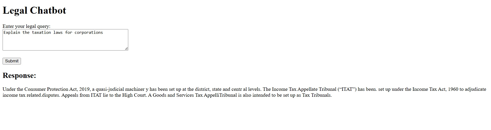

# Legal Chatbot Walkthrough

## 1. Architecture

*   **Overview:** This chatbot is designed to provide legal information by retrieving relevant content from two PDF documents ("Guide to Litigation in India" and "Legal Compliance & Corporate Laws by ICAI"). It uses a multi-agent design, with the Query Agent identifying relevant information and the Summarization Agent generating concise summaries for the user. The architecture is designed for straightforward functionality.
*   **Agents:**
    *   **Query Agent:** The Query Agent takes the user's query and searches for relevant text in the PDF documents. It uses sentence embeddings (numerical representations of the sentences) calculated using the `all-MiniLM-L6-v2` model from `sentence-transformers`. Cosine similarity is used to identify the most relevant chunks.
    *   **Summarization Agent:** The Summarization Agent receives the relevant text from the Query Agent and creates a concise summary. It uses the `facebook/bart-large-cnn` model from the `transformers` library for summarization. This model is a good balance of accuracy and speed, and is suitable for providing quick responses.
    
## 2. Code Explanation

*   **`utils.py`:**
    *   `read_pdf`:
        *   This function takes a PDF file path as input.
        *   It uses `PyPDF2` library to open and extract text from each page of the PDF.
        *   It handles `FileNotFoundError` and other exceptions to ensure that the code doesn't crash if a PDF can't be read.
    *   `chunk_text`:
        *   This function is used to split the combined text of the pdf file into smaller parts.
        *   It uses `RecursiveCharacterTextSplitter` from the `langchain.text_splitter` module.
        *   The function splits the text into chunks.
        *   `chunk_size` is set to 500 characters, and `chunk_overlap` is set to 100 characters to maintain the context.
    *   `create_embeddings`:
        *   This function takes the chunks and create the embeddings for the chunks.
        *   It uses `SentenceTransformer` model from `sentence_transformers` library, pre-trained on a variety of tasks and datasets for generating effective sentence embeddings.
        *   The model used is `'all-MiniLM-L6-v2'`.
    *   `find_relevant_chunks`:
        *   It takes the user's query, the embeddings of the PDF chunks, the model, and the list of chunks as input.
        *   It computes the embedding for the query using the same `SentenceTransformer` model.
        *   It then calculates the cosine similarity between the query embedding and each of the chunk embeddings. Cosine similarity helps measure how related two pieces of text are in terms of their meaning.
        *   It uses `argsort` to find the indices of the `top_n` most similar chunks, which represent the most relevant parts of the document to the query.
    *   `summarize_text`:
        *   This function is to generate summaries for the text.
        *   It uses `pipeline` from the `transformers` library, specifically configured for text summarization. The 'facebook/bart-large-cnn' model is used, which is known for its good summarization capabilities.
        *   The model produces summaries with the `max_length` set to 150 tokens and `min_length` set to 50 tokens.
        *   Error handling is included to deal with any potential issues during summarization.
*   **`app.py`:**
    *   The Flask app is set up with `Flask(__name__)`.
    *   The PDF documents are loaded and processed to create chunks and embeddings when the app starts. The file paths are constructed to ensure the app works correctly regardless of the deployment location.
    *   The `/` route serves the main page of the app, using the `index.html` template.
    *   The `/query` route handles incoming user queries using the POST method.
    *   The query is taken from the form data.
    *   The query agent is used to retrieve the most relevant text chunks from the PDFs based on the user’s question.
    *   The combined text is summarized using the summarization agent using the summarize_text function.
    *   The generated summary is returned in JSON format.

## 3. Demo

*   **Example 1:**
    *   **Query:** "Explain the taxation laws for corporations."
    *   **Response:** Under the Consumer Protection Act, 2019, a quasi-judicial machiner y has been set up at the district, state and centr al levels. The Income Tax Appellate Tribunal (“ITAT”) has been. set up under the Income Tax Act, 1960 to adjudicate income tax related.disputes. Appeals from ITAT lie to the High Court. A Goods and Services Tax AppelliTribunal is also intended to be set up as Tax Tribunals.
    *   **Screenshot:** 

## 4. Challenges Faced

*   One challenge I faced was [Describe a specific challenge. For example, "fine-tuning the chunk size and overlap to get the best results from the summarization model"].
*   Another challenge was [Describe another challenge, e.g., "Handling potential errors when loading and processing PDF files."]
*   I learned [Describe something you learned, e.g., "I learned how to use sentence embeddings to perform semantic search and the importance of handling errors"]

## 5. Possible Improvements

*   **Improve Sentence Splitting:** The current method of sentence splitting (splitting on periods) can be improved. Using a more advanced method for better sentence splitting would improve results.
*   **Implement a Conversational Interface:** A more user-friendly interface would be to include a conversational approach by allowing the chatbot to ask follow-up questions to clarify or get more relevant information from the user.
*   **Use a Larger Summarization Model:** Experiment with different summarization models.
*   **Add Source Information:**  Include the source document of the summarized response.